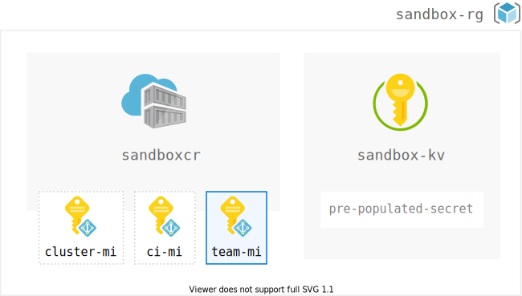

# cidemo-team-sandbox

### Use Case

A central cloud operations team deploys a sandbox for a developer team. 

_Note: Managed Identities are illustrated for example scenario considerations described below._

## Resources deployed

### Infrastructure

The Terraform scripts in this repository deploy:

| Resource | Description |
|:--|:--|
| Azure Resource Group | Sandbox logical and security boundary |
| Azure Key Vault | Can be pre-populated with credentials for team |
| Azure Container Registry | Team stores their Docker images here |

### Considerations for DevOps at Organizations

This repo does not do much because it's  demo. In real life however, the most common use case is to bootstrap a sandbox that is pre-configured to connect with shared resources, especially networking (think hub and spoke architectures).

Here are some other considerations to think about.

- What permissions at which scope do teams receive?_Why?_
- Why should every team get their own Azure Container Registry?
  
### Example: Managed Identities

As an exercise, imagine we also bootstrap the following:

| Identity | Role | Description |
|:--|:--|:--|
| `ci-mi` | `AcrPush` | CI/CD tools need to push images |
| `cluster-mi` | `AcrPull` | Tools, e.g. Kubernetes cluster needs to be able to pull images |
| `team-mi` | `Contributor` | Team needs to manage this resource |

**Bonus Question**  
Why is `team-mi` have a solid and blue colored border? How is it different from the other 2 managed identities illustrated above?

For additional details see [Azure Container Registry Roles](https://docs.microsoft.com/en-us/azure/container-registry/container-registry-roles)

## Disclaimer

This is an example for **learning** DevOps in real life. It is neither a reference implementation nor reference architecture.
